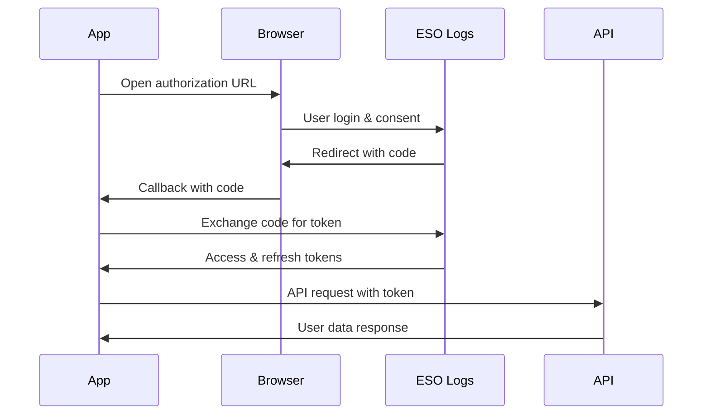

# User Data

Access user-specific information through OAuth2 authentication. These endpoints require user authorization and provide access to user profiles, guilds, and characters.

## Overview

- **Coverage**: 3 endpoints
- **Authentication**: Requires OAuth2 user authentication (not client credentials)
- **Endpoint**: Uses `/api/v2/user` instead of `/api/v2/client`
- **Scopes**: Requires `view-user-profile` scope for full access
- **Rate Limit Impact**: 1-2 points per request

## OAuth2 Authentication Deep Dive

UserData endpoints require OAuth2 Authorization Code flow, which is different from the client credentials flow used for other API endpoints.

### Why OAuth2 is Required

UserData endpoints access personal information:
- User's ESO Logs profile
- Associated guilds and their roles
- Linked characters
- Display names across servers

This sensitive data requires explicit user consent through OAuth2.

### Quick Setup with OAuth2Flow

The easiest way to implement OAuth2 is using the `OAuth2Flow` class:

```python
from esologs import OAuth2Flow, Client
import asyncio

# Create OAuth2 handler
oauth_flow = OAuth2Flow(
    client_id="your_client_id",
    client_secret="your_client_secret",
    redirect_uri="http://localhost:8765/callback"  # Must match ESO Logs app config
)

# Authorize (opens browser automatically)
user_token = oauth_flow.authorize(scopes=["view-user-profile"])

# Use the token
async def main():
    async with Client(
        url="https://www.esologs.com/api/v2/user",
        user_token=user_token
    ) as client:
        current_user = await client.get_current_user()
        print(f"Logged in as: {current_user.user_data.current_user.name}")

asyncio.run(main())
```

### Async OAuth2 Implementation

For async applications, use the `AsyncOAuth2Flow` class:

```python
from esologs import AsyncOAuth2Flow, Client
import asyncio

async def main():
    # Create async OAuth2 handler
    oauth_flow = AsyncOAuth2Flow(
        client_id="your_client_id",
        client_secret="your_client_secret",
        redirect_uri="http://localhost:8765/callback"
    )

    # Authorize asynchronously (still opens browser)
    user_token = await oauth_flow.authorize(scopes=["view-user-profile"])

    # Use the token
    async with Client(
        url="https://www.esologs.com/api/v2/user",
        user_token=user_token
    ) as client:
        current_user = await client.get_current_user()
        print(f"Logged in as: {current_user.user_data.current_user.name}")

asyncio.run(main())
```

### Manual OAuth2 Implementation

For custom implementations or web applications:

```python
from esologs.user_auth import (
    generate_authorization_url,
    exchange_authorization_code,
    UserToken
)

# Step 1: Generate authorization URL
import secrets

state = secrets.token_urlsafe(32)
auth_url = generate_authorization_url(
    client_id="your_client_id",
    redirect_uri="http://localhost:8000/callback",
    scopes=["view-user-profile"],
    state=state  # CSRF protection
)
print(f"Visit this URL to authorize: {auth_url}")

# Step 2: User authorizes and is redirected to your callback URL
# Extract the 'code' parameter from the callback

# Step 3: Exchange authorization code for access token
user_token = exchange_authorization_code(
    client_id="your_client_id",
    client_secret="your_client_secret",
    code="authorization_code_from_callback",
    redirect_uri="http://localhost:8000/callback"
)

# Or use async variant for better performance
user_token = await exchange_authorization_code_async(
    client_id="your_client_id",
    client_secret="your_client_secret",
    code="authorization_code_from_callback",
    redirect_uri="http://localhost:8000/callback"
)
```

### OAuth2 Flow Diagram



### Configuring Redirect URLs

Before using OAuth2, configure redirect URLs in your ESO Logs app:

1. Go to [ESO Logs API Clients](https://www.esologs.com/api/clients/)
2. Click "Edit" on your application
3. Add redirect URLs (comma-separated):
   - Development: `http://localhost:8765/callback`
   - Production: `https://yourdomain.com/auth/callback`
4. Save changes

!!! warning "Exact Match Required"
    Redirect URLs must match exactly, including:
    - Protocol (`http` vs `https`)
    - Domain/hostname
    - Port number
    - Path (including trailing slashes)

### Token Management

#### Token Structure

```python
from esologs.user_auth import UserToken

# UserToken is a Pydantic model with these fields:
user_token = UserToken(
    access_token="eyJ0eXAiOiJKV1QiLCJh...",  # JWT token
    token_type="Bearer",                       # Always "Bearer"
    expires_in=3600,                          # Seconds until expiration
    refresh_token="refresh_token_string",      # For refreshing access
    scope="view-user-profile",                # Granted permissions
    created_at=1234567890.0                   # Timestamp
)

# Check if expired
if user_token.is_expired:
    print("Token needs refresh")
```

#### Token Persistence

```python
from esologs.user_auth import save_token_to_file, load_token_from_file

# Save after authentication
save_token_to_file(user_token, ".esologs_token.json")

# Load in future sessions
saved_token = load_token_from_file(".esologs_token.json")

# Auto-refresh if needed
if saved_token and saved_token.is_expired:
    from esologs.user_auth import refresh_access_token

    new_token = refresh_access_token(
        client_id="your_client_id",
        client_secret="your_client_secret",
        refresh_token=saved_token.refresh_token
    )
    save_token_to_file(new_token)
```

##### Async Token Persistence

```python
from esologs.user_auth import (
    save_token_to_file_async,
    load_token_from_file_async,
    refresh_access_token_async
)

# Save asynchronously
await save_token_to_file_async(user_token, ".esologs_token.json")

# Load asynchronously
saved_token = await load_token_from_file_async(".esologs_token.json")

# Auto-refresh asynchronously if needed
if saved_token and saved_token.is_expired:
    new_token = await refresh_access_token_async(
        client_id="your_client_id",
        client_secret="your_client_secret",
        refresh_token=saved_token.refresh_token
    )
    await save_token_to_file_async(new_token)
```

### OAuth2 Scopes

Available scopes for ESO Logs:

| Scope | Description | Access Granted |
|-------|-------------|----------------|
| `view-user-profile` | View user profile | User's guilds, characters, display names |

Currently, only one scope is available. Request it during authorization:

```python
# With OAuth2Flow
user_token = oauth_flow.authorize(scopes=["view-user-profile"])

# With manual flow
auth_url = generate_authorization_url(
    client_id="your_client_id",
    redirect_uri="your_redirect_uri",
    scopes=["view-user-profile"]
)
```

## Methods

### get_current_user()

**Purpose**: Retrieve information about the currently authenticated user

**Note**: This method requires the `/api/v2/user` endpoint, not `/api/v2/client`

| Parameters | Type | Required | Description |
|-----------|------|----------|-------------|
| None | - | - | Uses the authenticated user's token |

**Returns**: `GetCurrentUser` object with the following structure:

| Field | Type | Description |
|-------|------|-------------|
| `user_data.current_user.id` | *int* | User ID |
| `user_data.current_user.name` | *str* | User name |
| `user_data.current_user.guilds` | *List[Guild]* | User's guilds (requires scope) |
| `user_data.current_user.characters` | *List[Character]* | User's characters (requires scope) |
| `user_data.current_user.na_display_name` | *str \| None* | NA server display name |
| `user_data.current_user.eu_display_name` | *str \| None* | EU server display name |

**Example**:
```python
import asyncio
from esologs.client import Client
from esologs.user_auth import UserToken

async def get_current_user_info():
    # Assume you have a user token from OAuth2 flow
    user_token = UserToken(
        access_token="user_access_token",
        token_type="Bearer",
        expires_in=3600
    )

    # Note: Using /api/v2/user endpoint
    async with Client(
        url="https://www.esologs.com/api/v2/user",
        user_token=user_token
    ) as client:

        current_user = await client.get_current_user()
        print(f"Logged in as: {current_user.user_data.current_user.name}")
        print(f"User ID: {current_user.user_data.current_user.id}")

        # List guilds (requires view-user-profile scope)
        for guild in current_user.user_data.current_user.guilds:
            print(f"Guild: {guild.name} on {guild.server.name}")

        # List characters (requires view-user-profile scope)
        for character in current_user.user_data.current_user.characters:
            print(f"Character: {character.name}")

asyncio.run(get_current_user_info())
```

**Output**:
```
Logged in as: ExampleUser
User ID: 12345
Guild: The Shadow Court on NA Megaserver
Guild: Tamriel Trading Co on EU Megaserver
Character: Khajiit Nightblade
Character: Argonian Templar
```

### get_user_by_id()

**Purpose**: Retrieve information about a specific user by their ID

| Parameters | Type | Required | Description |
|-----------|------|----------|-------------|
| `user_id` | *int* | Yes | The ID of the user to retrieve |

**Returns**: `GetUserById` object with the following structure:

| Field | Type | Description |
|-------|------|-------------|
| `user_data.user.id` | *int* | User ID |
| `user_data.user.name` | *str* | User name |
| `user_data.user.guilds` | *List[Guild] \| None* | User's guilds (requires scope) |
| `user_data.user.characters` | *List[Character] \| None* | User's characters (requires scope) |
| `user_data.user.na_display_name` | *str \| None* | NA server display name |
| `user_data.user.eu_display_name` | *str \| None* | EU server display name |

**Example**:
```python
import asyncio
from esologs.client import Client
from esologs.user_auth import UserToken

async def get_user_info():
    # Assume you have a user token from OAuth2 flow
    user_token = "user_access_token"

    async with Client(
        url="https://www.esologs.com/api/v2/user",
        user_token=user_token
    ) as client:

        # Get a specific user
        user = await client.get_user_by_id(user_id=67890)

        if user.user_data.user:
            print(f"User: {user.user_data.user.name}")
            print(f"NA Display: {user.user_data.user.na_display_name}")
            print(f"EU Display: {user.user_data.user.eu_display_name}")

            # Note: guilds/characters may be None without proper scope
            if user.user_data.user.guilds:
                print(f"Guilds: {len(user.user_data.user.guilds)}")
        else:
            print("User not found")

asyncio.run(get_user_info())
```

**Output**:
```
User: AnotherPlayer
NA Display: @AnotherPlayer
EU Display: @AnotherPlayerEU
Guilds: 3
```

### get_user_data()

**Purpose**: Get the userData root object (primarily for testing/validation)

| Parameters | Type | Required | Description |
|-----------|------|----------|-------------|
| None | - | - | No parameters |

**Returns**: `GetUserData` object containing the userData root

**Example**:
```python
import asyncio
from esologs.client import Client
from esologs.auth import get_access_token

async def test_user_api():
    # This uses client credentials, not user auth
    token = get_access_token()

    async with Client(
        url="https://www.esologs.com/api/v2/client",
        headers={"Authorization": f"Bearer {token}"}
    ) as client:

        # This will return minimal data without user auth
        user_data = await client.get_user_data()
        print("UserData API accessible")

asyncio.run(test_user_api())
```

## Authentication Flows

### Complete OAuth2 Example

Here's a complete example using Flask for the OAuth2 callback:

```python
from flask import Flask, request, redirect
from esologs.user_auth import (
    generate_authorization_url,
    exchange_authorization_code,
    save_token_to_file
)
from esologs.client import Client
import asyncio

app = Flask(__name__)

CLIENT_ID = "your_client_id"
CLIENT_SECRET = "your_client_secret"
REDIRECT_URI = "http://localhost:5000/callback"

@app.route('/')
def home():
    # Generate authorization URL
    auth_url = generate_authorization_url(
        client_id=CLIENT_ID,
        redirect_uri=REDIRECT_URI,
        scopes=["view-user-profile"]
    )
    return f'<a href="{auth_url}">Login with ESO Logs</a>'

@app.route('/callback')
def callback():
    # Get authorization code from callback
    code = request.args.get('code')
    if not code:
        return "Authorization failed", 400

    try:
        # Exchange code for token
        user_token = exchange_authorization_code(
            client_id=CLIENT_ID,
            client_secret=CLIENT_SECRET,
            code=code,
            redirect_uri=REDIRECT_URI
        )

        # Save token for later use
        save_token_to_file(user_token)

        # Use the token to get user info
        user_info = asyncio.run(get_user_info_async(user_token))

        return f"Logged in as: {user_info}"

    except Exception as e:
        return f"Error: {str(e)}", 500

async def get_user_info_async(user_token):
    async with Client(
        url="https://www.esologs.com/api/v2/user",
        user_token=user_token
    ) as client:
        current_user = await client.get_current_user()
        return current_user.user_data.current_user.name

if __name__ == '__main__':
    app.run(port=5000)
```

### Token Refresh

Access tokens expire after a period. Use the refresh token to get a new access token:

```python
from esologs.user_auth import refresh_access_token, load_token_from_file

# Load saved token
user_token = load_token_from_file()

if user_token and user_token.is_expired:
    # Refresh the token
    new_token = refresh_access_token(
        client_id="your_client_id",
        client_secret="your_client_secret",
        refresh_token=user_token.refresh_token
    )

    # Save the new token
    save_token_to_file(new_token)
```

#### Async Token Refresh

```python
from esologs.user_auth import (
    refresh_access_token_async,
    load_token_from_file_async,
    save_token_to_file_async
)

# Load and refresh asynchronously
user_token = await load_token_from_file_async()

if user_token and user_token.is_expired:
    # Refresh asynchronously
    new_token = await refresh_access_token_async(
        client_id="your_client_id",
        client_secret="your_client_secret",
        refresh_token=user_token.refresh_token
    )

    # Save asynchronously
    await save_token_to_file_async(new_token)
```

## Important Notes

1. **Endpoint Difference**: UserData methods require the `/api/v2/user` endpoint, not `/api/v2/client`
2. **Authentication**: These methods do not work with client credentials - they require OAuth2 user tokens
3. **Scopes**: The `view-user-profile` scope is required to access guild and character information
4. **Privacy**: Some fields may be `None` if the user hasn't granted appropriate permissions
5. **Rate Limits**: User endpoints have separate rate limits from client endpoints

## Common Issues & Troubleshooting

### Wrong Endpoint Error
```python
# ❌ This will fail
async with Client(
    url="https://www.esologs.com/api/v2/client",  # Wrong endpoint!
    user_token=user_token
) as client:
    current_user = await client.get_current_user()  # Will error

# ✅ Use the user endpoint
async with Client(
    url="https://www.esologs.com/api/v2/user",
    user_token=user_token
) as client:
    current_user = await client.get_current_user()  # Works!
```

### Redirect URI Mismatch

**Error**: `{"error":"invalid_request","error_description":"The redirect uri included is not valid."}`

**Solutions**:
1. Ensure exact match with configured URI
2. Check for trailing slashes
3. Verify port numbers match
4. Use the same URI for both authorization and token exchange

```python
# If your app has this configured: http://localhost:8765/callback

# ✅ Correct
oauth_flow = OAuth2Flow(
    client_id="...",
    client_secret="...",
    redirect_uri="http://localhost:8765/callback"
)

# ❌ Wrong - different port
redirect_uri="http://localhost:8000/callback"

# ❌ Wrong - trailing slash
redirect_uri="http://localhost:8765/callback/"

# ❌ Wrong - https instead of http
redirect_uri="https://localhost:8765/callback"
```

### Invalid Client Authentication

**Error**: `{"error":"invalid_client","error_description":"Client authentication failed"}`

**Common Causes**:
1. Wrong client ID or secret
2. Using a public client (no secret) with private client code
3. Mixing up client credentials with user tokens

```python
# Check your client type on ESO Logs:
# - Private Client: Has both ID and secret
# - Public Client: Only has ID (uses PKCE flow)

# For private clients:
oauth_flow = OAuth2Flow(
    client_id="your_client_id",
    client_secret="your_client_secret",  # Required for private clients
    redirect_uri="..."
)
```

### Missing Scope Error

If guilds/characters are `None` but other fields are populated, the user hasn't granted the `view-user-profile` scope:

```python
# Always request the scope during authorization
user_token = oauth_flow.authorize(scopes=["view-user-profile"])

# Or with manual flow:
auth_url = generate_authorization_url(
    client_id="your_client_id",
    redirect_uri="your_callback_url",
    scopes=["view-user-profile"]  # Required for full access
)
```

### CSRF State Validation Failed

**Error**: `Invalid state parameter - possible CSRF attack`

**Cause**: The state parameter from the callback doesn't match the one sent

**Solution**: Ensure you're not mixing OAuth2 sessions:
```python
# Don't run multiple OAuth2 flows simultaneously
# Each flow generates a unique state for security
```

### Token Expired

```python
# Check before using
if user_token.is_expired:
    # Refresh the token
    new_token = refresh_access_token(
        client_id="your_client_id",
        client_secret="your_client_secret",
        refresh_token=user_token.refresh_token
    )
    user_token = new_token
```

### Browser Doesn't Open (OAuth2Flow)

```python
# Disable auto-open and manually visit URL
user_token = oauth_flow.authorize(
    scopes=["view-user-profile"],
    open_browser=False  # Don't auto-open
)
# Manually visit the URL printed in console
```

### Port Already in Use

If using OAuth2Flow and getting "Address already in use":

```python
# Use a different port
oauth_flow = OAuth2Flow(
    client_id="...",
    client_secret="...",
    redirect_uri="http://localhost:9999/callback"  # Different port
)
# Remember to update your ESO Logs app configuration!
```

## Security Best Practices

1. **Never expose tokens in URLs or logs**
   ```python
   # ❌ Don't log full tokens
   print(f"Token: {user_token.access_token}")

   # ✅ Log partial tokens for debugging
   print(f"Token: {user_token.access_token[:20]}...")
   ```

2. **Validate state parameter in callbacks**
   - OAuth2Flow does this automatically
   - Manual implementations must verify state matches

3. **Store tokens securely**
   - Use encryption for production storage
   - Never commit token files to version control
   - Set appropriate file permissions

4. **Handle token refresh gracefully**
   - Check expiration before API calls
   - Implement automatic refresh logic
   - Handle refresh token expiration (re-authenticate)

5. **Use HTTPS in production**
   - Development: `http://localhost` is acceptable
   - Production: Always use `https://` URLs
