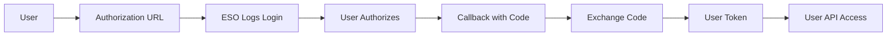

# Authentication

ESO Logs Python uses OAuth2 authentication to securely access the ESO Logs API v2.

## Prerequisites

Before you can authenticate, you need:

1. **ESO Logs Account**: Create a free account at [esologs.com](https://www.esologs.com/)
2. **API Client**: Register an application to get your credentials
3. **Environment Setup**: Configure your credentials securely

## Creating an API Client

### Step 1: Register Your Application

1. Visit [ESO Logs API Clients](https://www.esologs.com/api/clients/)
2. Click **"+ Create Client"** (top right corner)
3. Fill out the application form:

   | Field | Value | Notes |
   |-------|-------|-------|
   | **Application Name** | Your Application Name | e.g., "My ESO Analysis Tool" - be descriptive |
   | **Redirect URLs** | See below | Required for OAuth2 user authentication flow |
   | **Public Client** | Leave unchecked | Only check if you cannot store client secret securely |

   **For Redirect URLs:**
   - **Client Credentials Only**: Leave blank if you only need API access (no user data)
   - **User Authentication**: Enter URLs for OAuth2 callbacks (comma-separated if multiple)
     - Development: `http://localhost:8765/callback` (recommended port for this library)
     - Production: `https://yourdomain.com/auth/callback`
   - Multiple URLs supported, separated by commas

   !!! tip "Application Naming"
       Be descriptive with your application name. As noted in the form: "If we can't understand what the application is, we're more likely to cancel the key."

   !!! info "Public Client vs Private Client"
       - **Private Client (Recommended)**: Can securely store client secret. Use for server-side applications, CLI tools, and scripts.
       - **Public Client**: Cannot store client secret securely. Uses PKCE (Proof Key for Code Exchange) flow. Mainly for mobile apps or browser-based applications.

       For ESO Logs Python library usage, keep "Public Client" **unchecked** unless you have specific security constraints.

4. Click **"Create"**

### Step 2: Get Your Credentials

After creating your client, you'll be returned to the "Manage Your Clients" page where your new client will be listed. Each client displays:

- **Client Name**: The name you provided
- **Client ID**: The public identifier (visible in the listing)
- **Homepage URL**: If you provided one during creation
- **Edit/Delete buttons**: For managing your client

To access your credentials:

1. Click **"Edit"** on your client
2. You'll see your **Client ID** and **Client Secret**
3. Copy both values for use in your application

**Credentials you'll receive:**
- **Client ID**: Public identifier (like a username) - visible in listings
- **Client Secret**: Private key (only visible when editing) - keep this secure!

!!! warning "Keep Your Secret Safe"
    **Never** commit your Client Secret to version control or share it publicly.
    Treat it like a password - store it securely using environment variables.

## Setting Up Credentials

### Method 1: Environment Variables (Recommended)

Set your credentials as environment variables:

=== "Linux/macOS"

    ```bash
    # Add to your shell profile (~/.bashrc, ~/.zshrc, etc.)
    export ESOLOGS_ID="your_client_id_here"
    export ESOLOGS_SECRET="your_client_secret_here"

    # Apply changes
    source ~/.bashrc  # or restart your terminal
    ```

=== "Windows (PowerShell)"

    ```powershell
    # Set for current session
    $env:ESOLOGS_ID="your_client_id_here"
    $env:ESOLOGS_SECRET="your_client_secret_here"

    # Set permanently (requires restart)
    [Environment]::SetEnvironmentVariable("ESOLOGS_ID", "your_client_id_here", "User")
    [Environment]::SetEnvironmentVariable("ESOLOGS_SECRET", "your_client_secret_here", "User")
    ```

=== "Windows (Command Prompt)"

    ```cmd
    # Set for current session
    set ESOLOGS_ID=your_client_id_here
    set ESOLOGS_SECRET=your_client_secret_here

    # Set permanently
    setx ESOLOGS_ID "your_client_id_here"
    setx ESOLOGS_SECRET "your_client_secret_here"
    ```

### Method 2: .env File

Create a `.env` file in your project root:

```bash
# .env
ESOLOGS_ID=your_client_id_here
ESOLOGS_SECRET=your_client_secret_here
```

!!! danger "Security Warning"
    Add `.env` to your `.gitignore` file to prevent committing credentials:

    ```gitignore
    # .gitignore
    .env
    *.env
    .env.local
    ```

### Method 3: Direct Parameter Passing

For testing or specific use cases, you can pass credentials directly:

```python
from esologs.auth import get_access_token

# Direct parameter passing (not recommended for production)
token = get_access_token(
    client_id="your_client_id",
    client_secret="your_client_secret"
)
```

## Using Authentication

### Basic Authentication

```python
from esologs.auth import get_access_token

# Get access token using environment variables
token = get_access_token()

print(f"Access token: {token[:20]}...")  # Show first 20 chars
```

### With the Client

```python
import asyncio
from esologs.client import Client
from esologs.auth import get_access_token

async def main():
    # Get authentication token
    token = get_access_token()

    # Create authenticated client
    async with Client(
        url="https://www.esologs.com/api/v2/client",
        headers={"Authorization": f"Bearer {token}"}
    ) as client:

        # Test authentication with rate limit check
        rate_limit = await client.get_rate_limit_data()
        print(f"Rate limit: {rate_limit.rate_limit_data.limit_per_hour}")
        print(f"Points used: {rate_limit.rate_limit_data.points_spent_this_hour}")

asyncio.run(main())
```

### Error Handling

```python
import asyncio
from esologs.auth import get_access_token
from esologs.client import Client
from esologs.exceptions import GraphQLClientHttpError

async def test_authentication():
    try:
        token = get_access_token()
        print("✅ Token obtained successfully")

        # Test token with API call
        async with Client(
            url="https://www.esologs.com/api/v2/client",
            headers={"Authorization": f"Bearer {token}"}
        ) as client:
            rate_limit = await client.get_rate_limit_data()
            print("✅ Authentication successful")
            print(f"Rate limit: {rate_limit.rate_limit_data.limit_per_hour}/hour")

    except GraphQLClientHttpError as e:
        if e.status_code == 401:
            print("❌ Authentication failed: Invalid credentials")
            print("Check your ESOLOGS_ID and ESOLOGS_SECRET environment variables")
        else:
            print(f"❌ HTTP error: {e.status_code}")
    except Exception as e:
        print(f"❌ Unexpected error: {e}")

asyncio.run(test_authentication())
```

## OAuth2 User Authentication

For accessing user-specific data, you need to implement OAuth2 Authorization Code flow.

### Quick Start with OAuth2Flow (Recommended)

The simplest way to handle OAuth2 user authentication is with the `OAuth2Flow` class:

```python
from esologs import OAuth2Flow, Client
import asyncio

# Create OAuth2 flow handler
oauth_flow = OAuth2Flow(
    client_id="your_client_id",
    client_secret="your_client_secret",
    redirect_uri="http://localhost:8765/callback"  # Must match your ESO Logs app config
)

# This will:
# 1. Start a local server on port 8765
# 2. Open your browser for authorization
# 3. Capture the callback automatically
# 4. Exchange the code for a token
user_token = oauth_flow.authorize(scopes=["view-user-profile"])

# Use the token
async def main():
    async with Client(
        url="https://www.esologs.com/api/v2/user",
        user_token=user_token
    ) as client:
        current_user = await client.get_current_user()
        print(f"Logged in as: {current_user.user_data.current_user.name}")

asyncio.run(main())
```

!!! info "Redirect URI Configuration"
    Make sure to add `http://localhost:8765/callback` to your ESO Logs app's redirect URLs.
    The OAuth2Flow class extracts the port from your redirect URI automatically.

### Manual OAuth2 Flow

For more control or custom implementations, you can use the manual flow:

### Setting Up User Authentication

```python
from esologs.user_auth import (
    generate_authorization_url,
    exchange_authorization_code,
    refresh_access_token,
    UserToken
)

# Step 1: Generate authorization URL
auth_url = generate_authorization_url(
    client_id="your_client_id",
    redirect_uri="http://localhost:8000/callback",
    scopes=["view-user-profile"],
    state="random_state_string"  # Optional CSRF protection
)

print(f"Please visit: {auth_url}")
# User will be redirected to ESO Logs login page
```

### Handling the Callback

After authorization, the user is redirected to your callback URL with a code:

```python
# Step 2: Exchange authorization code for token
# (In your callback handler)
code = request.args.get('code')  # Get from callback URL

user_token = exchange_authorization_code(
    client_id="your_client_id",
    client_secret="your_client_secret",
    code=code,
    redirect_uri="http://localhost:8000/callback"
)

# user_token contains:
# - access_token: Bearer token for API requests
# - refresh_token: Token to refresh expired access
# - expires_in: Token lifetime in seconds
```

### Using User Authentication

```python
import asyncio
from esologs.client import Client

async def get_user_info():
    # Note: Using /api/v2/user endpoint (not /client)
    async with Client(
        url="https://www.esologs.com/api/v2/user",
        user_token=user_token  # Can be UserToken object or string
    ) as client:

        # Get current user information
        current_user = await client.get_current_user()
        print(f"Logged in as: {current_user.user_data.current_user.name}")

        # Access user's guilds
        for guild in current_user.user_data.current_user.guilds:
            print(f"Guild: {guild.name} on {guild.server.name}")

asyncio.run(get_user_info())
```

### Token Persistence

Save and load tokens for persistent authentication:

```python
from esologs.user_auth import save_token_to_file, load_token_from_file

# Save token after authentication
save_token_to_file(user_token, ".esologs_token.json")

# Load token later
saved_token = load_token_from_file(".esologs_token.json")

if saved_token and saved_token.is_expired:
    # Refresh if expired
    new_token = refresh_access_token(
        client_id="your_client_id",
        client_secret="your_client_secret",
        refresh_token=saved_token.refresh_token
    )
    save_token_to_file(new_token)
```

### Complete Flask Example

Here's a complete example web app with OAuth2 flow:

```python
from flask import Flask, request, redirect, session
from esologs.user_auth import (
    generate_authorization_url,
    exchange_authorization_code,
    save_token_to_file
)
from esologs.client import Client
import asyncio
import secrets

app = Flask(__name__)
app.secret_key = secrets.token_hex(32)

CLIENT_ID = "your_client_id"
CLIENT_SECRET = "your_client_secret"
REDIRECT_URI = "http://localhost:5000/callback"

@app.route('/')
def home():
    return '<a href="/login">Login with ESO Logs</a>'

@app.route('/login')
def login():
    # Generate CSRF token
    state = secrets.token_urlsafe(32)
    session['oauth_state'] = state

    # Generate authorization URL
    auth_url = generate_authorization_url(
        client_id=CLIENT_ID,
        redirect_uri=REDIRECT_URI,
        scopes=["view-user-profile"],
        state=state
    )

    return redirect(auth_url)

@app.route('/callback')
def callback():
    # Verify CSRF token
    state = request.args.get('state')
    if state != session.get('oauth_state'):
        return "Invalid state parameter", 400

    # Get authorization code
    code = request.args.get('code')
    if not code:
        return "Authorization failed", 400

    try:
        # Exchange code for token
        user_token = exchange_authorization_code(
            client_id=CLIENT_ID,
            client_secret=CLIENT_SECRET,
            code=code,
            redirect_uri=REDIRECT_URI
        )

        # Save token for later use
        save_token_to_file(user_token)
        session['user_token'] = user_token.access_token

        return redirect('/profile')

    except Exception as e:
        return f"Error: {str(e)}", 500

@app.route('/profile')
def profile():
    token = session.get('user_token')
    if not token:
        return redirect('/login')

    # Get user info asynchronously
    user_info = asyncio.run(get_user_profile(token))

    return f"""
    <h1>Welcome, {user_info['name']}!</h1>
    <p>User ID: {user_info['id']}</p>
    <p>Guilds: {', '.join(user_info['guilds'])}</p>
    <p>Characters: {', '.join(user_info['characters'])}</p>
    <a href="/logout">Logout</a>
    """

async def get_user_profile(token):
    async with Client(
        url="https://www.esologs.com/api/v2/user",
        user_token=token
    ) as client:
        current_user = await client.get_current_user()
        user = current_user.user_data.current_user

        return {
            'name': user.name,
            'id': user.id,
            'guilds': [g.name for g in user.guilds],
            'characters': [c.name for c in user.characters]
        }

@app.route('/logout')
def logout():
    session.clear()
    return redirect('/')

if __name__ == '__main__':
    app.run(port=5000, debug=True)
```

### Important Notes

1. **Different Endpoint**: User authentication requires `/api/v2/user` endpoint, not `/api/v2/client`
2. **Scopes**: Request `view-user-profile` scope to access user's guilds and characters
3. **Security**: Always validate the `state` parameter to prevent CSRF attacks
4. **Token Storage**: Never expose tokens in URLs or client-side code
5. **Refresh Tokens**: Store refresh tokens securely to maintain persistent authentication

## Authentication Flow

ESO Logs Python supports two OAuth2 authentication flows:

### Client Credentials Flow (Default)

Used for most API access:

```mermaid
graph LR
    A[Your App] --> B[get_access_token()]
    B --> C[ESO Logs OAuth2]
    C --> D[Access Token]
    D --> E[API Requests]
    E --> F[ESO Logs API v2]
```

1. **Client Registration**: Your app is registered with ESO Logs
2. **Token Request**: App requests access token using credentials
3. **Token Response**: ESO Logs returns a bearer token
4. **API Access**: Token is used for authenticated API requests
5. **Token Refresh**: Tokens are automatically refreshed as needed

### Authorization Code Flow (User Authentication)

Required for user-specific data (UserData endpoints):



1. **Generate Auth URL**: Create URL for user to authorize
2. **User Authorization**: User logs in and grants permissions
3. **Authorization Code**: User redirected back with code
4. **Token Exchange**: Exchange code for access/refresh tokens
5. **API Access**: Use token for user-specific endpoints

## Token Management

### Automatic Token Refresh

ESO Logs Python automatically handles token refresh:

- Tokens are cached and reused until expiration
- New tokens are requested automatically when needed
- No manual token management required

### Token Validation

Verify your token is working:

```python
import asyncio
from esologs.client import Client
from esologs.auth import get_access_token

async def validate_token():
    """Validate authentication token by making a simple API call."""
    try:
        token = get_access_token()

        async with Client(
            url="https://www.esologs.com/api/v2/client",
            headers={"Authorization": f"Bearer {token}"}
        ) as client:

            # Simple validation call
            rate_limit = await client.get_rate_limit_data()

            print("✅ Token valid")
            print(f"Rate limit: {rate_limit.rate_limit_data.limit_per_hour}/hour")
            print(f"Used: {rate_limit.rate_limit_data.points_spent_this_hour}")
            return True

    except Exception as e:
        print(f"❌ Token validation failed: {e}")
        return False

# Run validation
asyncio.run(validate_token())
```

## Security Best Practices

### Environment Variables

✅ **Do**:
- Use environment variables for production
- Add to your shell profile for persistence
- Use different credentials for development/production

❌ **Don't**:
- Hard-code credentials in source code
- Commit credentials to version control
- Share credentials in chat/email

### File-based Configuration

If using `.env` files:

```python
# config.py
import os
from pathlib import Path

# Load from .env file
def load_env():
    env_path = Path('.env')
    if env_path.exists():
        with open(env_path) as f:
            for line in f:
                if line.strip() and not line.startswith('#'):
                    key, value = line.strip().split('=', 1)
                    os.environ[key] = value

load_env()
```

### Production Deployment

For production environments:

- Use secure environment variable management
- Consider services like AWS Secrets Manager, Azure Key Vault
- Implement credential rotation
- Monitor API usage and rate limits

## Troubleshooting

### Common Authentication Errors

#### OAuth2 Redirect URI Mismatch

```
{"error":"invalid_request","error_description":"The redirect uri included is not valid."}
```

**Solutions**:
1. Ensure your redirect URI exactly matches one configured in your ESO Logs app
2. Check for trailing slashes - `http://localhost:8765/callback` vs `http://localhost:8765/callback/`
3. Verify the port number matches
4. Add multiple redirect URIs for different environments (dev/prod)

#### Invalid Client Credentials

```
Exception: OAuth request failed with status 401: {"error":"invalid_client","error_description":"Client authentication failed","message":"Client authentication failed"}
```

**Solutions**:
1. Verify your Client ID and Secret are correct
2. Check for extra spaces or hidden characters
3. Ensure environment variables are set properly
4. Try regenerating your Client Secret on the ESO Logs website

#### Rate Limit Exceeded

```
GraphQLClientHttpError: HTTP status code: 429
```

**Solutions**:
1. Check your current usage with `get_rate_limit_data()`
2. Implement request throttling in your application
3. Consider upgrading your ESO Logs plan
4. Cache responses to reduce API calls

#### Network Connection Issues

```
GraphQLClientHttpError: HTTP status code: 503
```
or
```
httpx.ConnectError: [Errno -2] Name or service not known
```

**Solutions**:
1. Check your internet connection
2. Verify ESO Logs API status
3. Check firewall/proxy settings
4. Try again after a brief delay

### Debugging Authentication

Enable debug logging to troubleshoot issues:

```python
import logging
from esologs.auth import get_access_token

# Enable debug logging
logging.basicConfig(level=logging.DEBUG)

# Get token with debug info
token = get_access_token()
```

## Next Steps

With authentication configured:

1. **[Start with Quickstart](quickstart.md)** - Make your first API calls
2. **[Read API Reference](api-reference/game-data.md)** - Understand available methods with examples
3. **[Development Guide](development/setup.md)** - Set up for contributing

!!! tip "Rate Limits"
    ESO Logs API has rate limits based on points per hour. Use `get_rate_limit_data()`
    to monitor your usage and avoid hitting limits.

!!! info "Multiple Applications"
    You can create multiple API clients for different applications or environments.
    Each client gets its own rate limit allocation.
