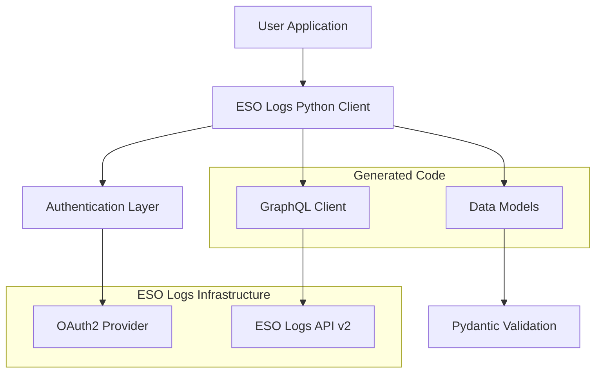
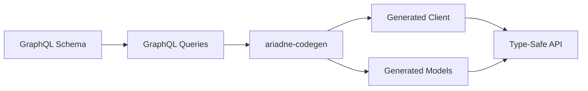
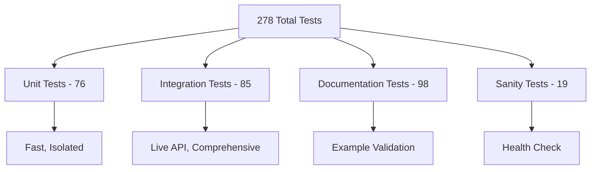
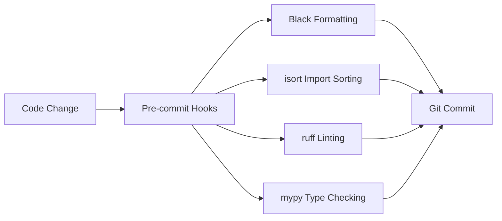

# Architecture Overview

Technical overview of ESO Logs Python's architecture, design patterns, and implementation details.

## High-Level Architecture



## Core Components

### 1. Refactored Client Architecture

**Purpose**: Modular, maintainable client implementation using factory patterns and mixins

The client has been refactored from a monolithic 1,600+ line file to a clean, modular architecture:

```python
# esologs/client.py (86 lines)
class Client(
    AsyncBaseClient,
    GameDataMixin,
    CharacterMixin,
    WorldDataMixin,
    GuildMixin,
    ReportMixin,
):
    """ESO Logs API client with comprehensive validation and security features."""
```

**Architecture Components**:

- **Factory Methods** (`method_factory.py`): Dynamic method generation
  - `create_simple_getter()`: For single ID parameter methods
  - `create_complex_method()`: For methods with multiple parameters
  - `create_method_with_builder()`: For methods using parameter builders
- **Mixins** (`mixins/`): Methods organized by functional area
  - `GameDataMixin`: Abilities, items, NPCs, classes, factions, maps
  - `CharacterMixin`: Character info, reports, rankings
  - `WorldDataMixin`: World data, zones, regions, encounters
  - `GuildMixin`: Guild information
  - `ReportMixin`: Combat reports, events, graphs, rankings
- **Parameter Builders** (`param_builders.py`): Complex parameter handling
- **GraphQL Queries** (`queries.py`): Centralized query storage

### 2. GraphQL Client Layer

**Purpose**: Auto-generated client for type-safe API communication

```python
# Generated by ariadne-codegen
class Client(BaseClient):
    async def get_character_by_id(self, id: int) -> GetCharacterByIdResponse:
        query = gql("""
            query GetCharacterById($id: Int!) {
                characterData {
                    character(id: $id) {
                        id
                        name
                        server { name }
                    }
                }
            }
        """)
        # Implementation auto-generated
```

**Key Features**:
- **Type Safety**: Full type hints with Pydantic models
- **Query Optimization**: Efficient GraphQL query generation
- **Error Handling**: Proper exception hierarchy
- **Async/Await**: Native async support with httpx

### 2. Authentication System

**Purpose**: OAuth2 client credentials flow for secure API access

```python
# esologs/auth.py
def get_access_token(client_id=None, client_secret=None):
    """Get OAuth2 access token using client credentials flow."""

    # Environment variable fallback
    client_id = client_id or os.getenv("ESOLOGS_ID")
    client_secret = client_secret or os.getenv("ESOLOGS_SECRET")

    # OAuth2 request to ESO Logs
    response = requests.post("https://www.esologs.com/oauth/token", {
        "grant_type": "client_credentials",
        "client_id": client_id,
        "client_secret": client_secret
    })

    return response.json()["access_token"]
```

**Security Features**:
- **Environment Variables**: Secure credential storage
- **Token Caching**: Automatic token reuse until expiration
- **Error Handling**: Clear authentication error messages
- **No Storage**: Tokens not persisted to disk

### 3. Data Model Layer

**Purpose**: Type-safe data structures with validation

```python
# Generated Pydantic models
class Character(BaseModel):
    id: int
    name: str
    server: Server
    class_id: Optional[int] = None
    race_id: Optional[int] = None

    class Config:
        # Allow extra fields for future API expansion
        extra = "ignore"

class CharacterResponse(BaseModel):
    character_data: CharacterData
```

**Design Principles**:
- **Immutable Data**: Models are read-only after creation
- **Optional Fields**: Graceful handling of partial data
- **Validation**: Automatic input validation and type coercion
- **Future-Proof**: Extra fields ignored for API evolution

## Code Generation Pipeline

### Schema-First Development



### Generation Process

1. **Schema Definition** (`schema.graphql`)
   ```graphql
   type Character {
       id: Int!
       name: String!
       server: Server!
   }
   ```

2. **Query Definition** (`queries.graphql`)
   ```graphql
   query GetCharacterById($id: Int!) {
       characterData {
           character(id: $id) {
               id
               name
               server { name }
           }
       }
   }
   ```

3. **Code Generation** (`mini.toml`)
   ```toml
   [tool.ariadne-codegen]
   schema_path = "schema.graphql"
   queries_path = "queries.graphql"
   target_package_path = "esologs"
   plugins = ["ariadne_codegen.contrib.shorter_results"]
   ```

4. **Generated Output**
   - `esologs/_generated/`: All generated code in subdirectory
   - `esologs/client.py`: Refactored client using mixins and factory patterns
   - `esologs/models/`: Pydantic models for all types
   - `esologs/exceptions.py`: Custom exception classes

## Async Architecture

### Event Loop Integration

```python
# Proper async usage
async def main():
    token = get_access_token()  # Sync operation

    async with Client(
        url="https://www.esologs.com/api/v2/client",
        headers={"Authorization": f"Bearer {token}"}
    ) as client:  # Async context manager

        # All API calls are async
        character = await client.get_character_by_id(id=12345)
        reports = await client.get_character_reports(character_id=12345)

        # Concurrent operations
        results = await asyncio.gather(
            client.get_abilities(limit=10),
            client.get_classes(),
            client.get_zones()
        )

asyncio.run(main())
```

### Resource Management

- **Connection Pooling**: httpx manages HTTP connection reuse
- **Context Managers**: Automatic cleanup of resources
- **Timeout Handling**: Configurable request timeouts
- **Error Recovery**: Graceful handling of network issues

## Error Handling Strategy

### Exception Hierarchy

```python
# Base exception
class ESoLogsError(Exception):
    """Base exception for ESO Logs Python."""

# HTTP errors
class GraphQLClientHttpError(ESoLogsError):
    def __init__(self, status_code: int, response: httpx.Response):
        self.status_code = status_code
        self.response = response

# GraphQL errors
class GraphQLClientGraphQLError(ESoLogsError):
    def __init__(self, errors: List[Dict[str, Any]]):
        self.errors = errors

# Validation errors
class ValidationError(ESoLogsError):
    def __init__(self, field: str, value: Any, message: str):
        self.field = field
        self.value = value
        self.message = message
```

### Error Handling Patterns

```python
try:
    character = await client.get_character_by_id(id=12345)
except GraphQLClientHttpError as e:
    if e.status_code == 404:
        print("Character not found")
    elif e.status_code == 429:
        print("Rate limit exceeded")
    else:
        print(f"HTTP error: {e.status_code}")
except GraphQLClientGraphQLError as e:
    print(f"GraphQL errors: {e.errors}")
except ValidationError as e:
    print(f"Validation error for {e.field}: {e.message}")
```

## Testing Architecture

### Test Pyramid Structure



### Test Categories

1. **Unit Tests** (76 tests)
   - Parameter validation logic
   - Authentication token handling
   - Method signature verification
   - Error condition testing

2. **Integration Tests** (85 tests)
   - Live API endpoint testing
   - Response data validation
   - Error scenario verification
   - Workflow testing

3. **Documentation Tests** (98 tests)
   - All code examples validated
   - Documentation accuracy verification
   - Copy-paste example testing
   - API reference validation

4. **Sanity Tests** (19 tests)
   - Broad API coverage check
   - System health verification
   - Smoke testing for CI/CD
   - Living documentation

### Shared Test Infrastructure

```python
# tests/conftest.py
@pytest.fixture
async def authenticated_client():
    """Provide authenticated client for tests."""
    token = get_access_token()
    async with Client(
        url="https://www.esologs.com/api/v2/client",
        headers={"Authorization": f"Bearer {token}"}
    ) as client:
        yield client

# Shared test data
TEST_DATA = {
    "character_id": 34663,
    "guild_id": 3660,
    "report_code": "VfxqaX47HGC98rAp"
}
```

## Configuration Management

### Project Configuration (`pyproject.toml`)

```toml
[project]
name = "esologs-python"
version = "0.2.0a2"
dependencies = [
    "httpx>=0.24.0",
    "pydantic>=2.0.0",
    "requests>=2.25.0"
]

[project.optional-dependencies]
dev = [
    "pytest>=6.0.0",
    "pytest-asyncio>=0.21.0",
    "black>=22.0.0",
    "mypy>=1.0.0"
]
```

### Code Generation Config (`mini.toml`)

```toml
[tool.ariadne-codegen]
schema_path = "schema.graphql"
queries_path = "queries.graphql"
target_package_path = "esologs"
target_package_name = "esologs"
client_name = "Client"
plugins = ["ariadne_codegen.contrib.shorter_results"]

# Generated files configuration
[tool.ariadne-codegen.files]
client_file_path = "client.py"
exceptions_module_path = "exceptions.py"
models_package_path = "models"
```

## API Coverage & Extensibility

### Current Coverage (~75%)

```python
# Implemented API categories
IMPLEMENTED_APIS = {
    "game_data": ["abilities", "classes", "items", "npcs", "maps", "factions"],
    "character_data": ["profiles", "reports", "rankings"],
    "world_data": ["zones", "regions", "encounters"],
    "guild_data": ["basic_info", "reports"],
    "report_data": ["analysis", "search", "events", "tables"],
    "system": ["rate_limiting", "authentication"]
}
```

### Extension Patterns

1. **Adding New Endpoints**
   ```bash
   # 1. Update GraphQL queries
   vim queries.graphql

   # 2. Regenerate client
   ariadne-codegen client --config mini.toml

   # 3. Add tests
   pytest tests/integration/test_new_feature.py
   ```

2. **Adding Helper Methods**
   ```python
   # Add convenience methods to client
   async def get_character_summary(self, character_id: int):
       """Get comprehensive character summary."""
       character, reports = await asyncio.gather(
           self.get_character_by_id(id=character_id),
           self.get_character_reports(character_id=character_id, limit=5)
       )
       return {
           "character": character.character_data.character,
           "recent_reports": reports.character_data.character.recent_reports.data
       }
   ```

## Performance Considerations

### Query Optimization

- **Field Selection**: Request only needed fields
- **Pagination**: Implement proper pagination for large datasets
- **Caching**: Cache frequently accessed data
- **Batching**: Combine multiple queries when possible

### Connection Management

- **Connection Pooling**: httpx automatic connection reuse
- **Timeout Configuration**: Appropriate timeouts for different operations
- **Rate Limiting**: Respect API rate limits
- **Retry Logic**: Exponential backoff for transient errors

### Memory Management

- **Streaming**: Use async iterators for large datasets
- **Garbage Collection**: Proper cleanup of large objects
- **Memory Profiling**: Monitor memory usage in tests

## Security Architecture

### Authentication Security

- **Environment Variables**: Secure credential storage
- **No Persistence**: Tokens not stored on disk
- **HTTPS Only**: All communication encrypted
- **Token Rotation**: Automatic token refresh

### Input Validation

```python
def validate_character_id(character_id: int) -> int:
    """Validate character ID parameter."""
    if not isinstance(character_id, int):
        raise ValidationError("character_id", character_id, "Must be an integer")

    if character_id <= 0:
        raise ValidationError("character_id", character_id, "Must be positive")

    return character_id
```

### Output Sanitization

- **Pydantic Models**: Automatic data validation
- **Type Coercion**: Safe type conversion
- **Extra Field Handling**: Ignore unknown fields
- **SQL Injection Prevention**: No raw SQL queries

## Monitoring & Observability

### Rate Limit Monitoring

```python
async def check_rate_limits(client: Client):
    """Monitor current rate limit usage."""
    rate_limit = await client.get_rate_limit_data()

    usage = rate_limit.rate_limit_data.points_spent_this_hour
    limit = rate_limit.rate_limit_data.limit_per_hour

    print(f"Rate limit usage: {usage}/{limit} ({usage/limit*100:.1f}%)")
```

### Error Tracking

- **Structured Logging**: Consistent log format
- **Error Aggregation**: Group similar errors
- **Performance Metrics**: Track request latency
- **Health Checks**: Monitor API availability

## Future Architecture Considerations

### Planned Improvements

1. **DataFrame Integration**: Pandas/Polars support for data analysis
2. **Caching Layer**: Redis/SQLite caching for performance
3. **Rate Limit Management**: Automatic throttling and queuing
4. **WebSocket Support**: Real-time data streaming

### Scalability Patterns

- **Connection Pooling**: Optimize for high-throughput applications
- **Circuit Breaker**: Handle API downtime gracefully
- **Bulk Operations**: Batch multiple requests efficiently
- **Async Iterators**: Stream large datasets without memory issues

## Development Tools

### Code Quality Pipeline



### CI/CD Pipeline

1. **Unit Tests**: Fast validation of logic
2. **Integration Tests**: Live API testing
3. **Documentation Tests**: Example validation
4. **Code Quality**: Linting and type checking
5. **Documentation Build**: mkdocs site generation
6. **Release**: Automated versioning and publishing

This architecture provides a solid foundation for a type-safe, maintainable, and extensible GraphQL client library with comprehensive testing and documentation support.

!!! tip "Performance"
    The architecture prioritizes developer experience with type safety while maintaining
    high performance through async operations and efficient GraphQL queries.

!!! info "Extensibility"
    New API endpoints can be added by updating GraphQL queries and regenerating the client,
    making the library easy to extend as the ESO Logs API evolves.
