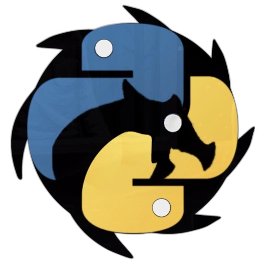
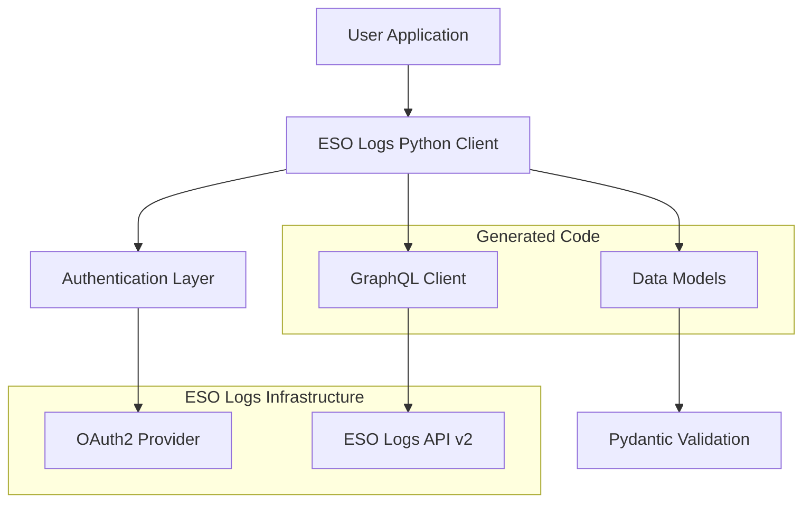

<center><h1>ESO Logs Python</h1></center>

<div class="hero-section">

  <div style="text-align: center; margin-bottom: 2rem;">
    <picture>
      <source type="image/webp" srcset="assets/logo.webp">
      
    </picture>
  </div>

  <p>A comprehensive Python client for the ESO Logs API v2</p>
  <ul>
		<li> <b>Type Safety</b>: Full type hints with Pydantic models</li>
		<li> <b>Async First</b>: Native async/await support with HTTP and WebSocket</li>
		<li> <b>GraphQL Integration</b>: Code generation with `ariadne-codegen` + Claude</li>
		<li> <b>Security</b>: OAuth2 authentication with parameter validation</li>
		<li> <b>Testing</b>: 278 tests with comprehensive coverage</li>
  </ul>
</div>

## Quickstart
=== "Installation"

    ```bash
    # Install from PyPI
    pip install esologs-python==0.2.0a2

    # Or install latest development version
    git clone https://github.com/knowlen/esologs-python.git
    cd esologs-python
    pip install -e .
    ```

=== "Authentication"

    ```bash
    # Set your API credentials
    export ESOLOGS_ID="your_client_id"
    export ESOLOGS_SECRET="your_client_secret"
    ```

=== "Basic Usage"

    ```python
    import asyncio
    from esologs.client import Client
    from esologs.auth import get_access_token

    async def main():
        token = get_access_token()

        async with Client(
            url="https://www.esologs.com/api/v2/client",
            headers={"Authorization": f"Bearer {token}"}
        ) as client:

            # Get character information
            character = await client.get_character_by_id(id=12345)
            print(f"Character: {character.character_data.character.name}")

            # Search for reports
            reports = await client.search_reports(
                guild_id=123,
                zone_id=456,
                limit=10
            )

    asyncio.run(main())
    ```

## Status
<div class="feature-grid">
  <div class="feature-card">
    <h3>Current Version</h3>
    <p><strong>v0.2.0-alpha</strong><br>
    <span class="status-badge status-badge--completed">83% API Coverage</span></p>
    <p>Active development with comprehensive testing and documentation.</p>
  </div>
</div>

<div class="feature-grid">
  <div class="feature-card">
    <h3>Coming Soon (17%)</h3>
    <ul>
      <li><span class="status-badge status-badge--planned">User Accounts</span> Account management & settings </li>
      <li><span class="status-badge status-badge--planned">Progress Tracking</span> Race & achievement tracking</li>
      <li><span class="status-badge status-badge--planned">Enhanced Guilds</span> Advanced guild management</li>
      <li><span class="status-badge status-badge--planned">Caching</span> Performance optimization</li>
    </ul>
  </div>
</div>


## Architecture


!!! note "Development Status"
    This library is in active development. While the core functionality is stable and tested,
    the API may change before the 1.0 release. See our [changelog](changelog.md) for the latest updates.
